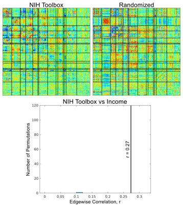
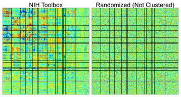

# nulledge

A null model for comparing two sets of edges, written in Matlab.

<br clear="left" />

Many edge matrices appear similar. **nulledge** is a null model for edge matrix similarity. It generates randomized edge matrices conformant to the natural clustering structure of brain connectivity.

<div align="center"></div>

## Features

- Generates randomized edge matrices conformant to clustered network structure.
- Accounts for correlation between variables $x_1$ and $x_2$.
- If $x_2$ is not available, it can be inferred from the connectivity matrix $b_2$.
- Readable, object-oriented Matlab code.

## Quick Start

Clone the git repository and start Matlab.

```bash
git clone https://github.com/DosenbachGreene/nulledge.git
cd nulledge
matlab
```

Create a new `NullEdgeModel`, permute it, plot a histogram, and calculate a p-value.

```
model = NullEdgeModel;
model.Y = Y;   % edge
model.Z = Z;   % covariates
model.x1 = x1; % 1st variable (e.g. NIH Toolbox)
model.x2 = x2; % 2nd variable (e.g. income)
r = model.similarity()   % correlation between b1 and b2
rnull = model.permute(); % generate null model
histogram(abs(rnull)); xline(abs(r));
p_value = sum(abs(rnull) > abs(r)) / length(rnull);
```

See the comments/help information in [`NullEdgeModel.m`](nulledgemodel.m) for more information.

## The Problem

The experienced neuroimaging scientist recognizes that many edge matrices resemble one another, therefore when comparing two edge matrices (e.g. using Pearson linear correlation) the threshold for significance is not $r = 0$. It would be tempting to generate a null model by randomly shuffling the entries of one or both edge matrices. As illustrated below, such a randomization scheme without respect to the *clustered* network structure of brain connectivity produces implausible edge matrices that result in small $r_{null}$ and overstimate the significance of $r$.

<div align="center"></div>

**nulledge** randomizes edges with respect to the clustered network structure. The clustering is automatically estimated from the observed edges $Y$ using singular value decomposition.

## Math

For a given study participant, the voxel, parcel, or node-wise connectivity, or *edge* matrix can be flattened into a row vector of its edges.

$$
\begin{array}{ccc}
\underbrace{\left[\begin{matrix}
& y_1 & y_2 & y_3 \\
& & y_4 & y_5 \\
& & & y_m \\
& & &
\end{matrix}\right]} & \rightarrow & \underbrace{\left[\begin{matrix}y_1 & y_2 & y_3 & y_4 & y_5 & \cdots & y_m\end{matrix}\right]} \\
\textrm{voxels} & & \textrm{edges}
\end{array}
$$

Given some predictor variables $X$ on each participant (e.g. height, NIH Toolbox score, etc), a linear regression model is used to solve for some edge vectors $\beta$. Each row in $X$ and $Y$ is a participant in the study. Each row in $\beta$ is the edge vector for the corresponding column in $X$.

$$
Y = X\beta + \epsilon,\ \epsilon\overset{iid}{\sim}\mathcal{N}\left(0, \sigma^2\right)
$$

$$
\begin{array}{cccccc}
\underset{n\times m}{Y} = & \underbrace{\left[\begin{matrix}
y_{11} & y_{22} & \cdots & y_{1m} \\
y_{21} & y_{22} & \cdots & y_{2m} \\
\vdots & \vdots & \ddots & \vdots \\
y_{n1} & y_{n2} & \cdots & y_{nm}
\end{matrix}\right]}, &
\underset{n\times p}{X} = & \underbrace{\left[\begin{matrix}
x_{11} & x_{22} & \cdots & x_{1p} \\
x_{21} & x_{22} & \cdots & x_{2p} \\
\vdots & \vdots & \ddots & \vdots \\
x_{n1} & x_{n2} & \cdots & x_{np}
\end{matrix}\right]}, &
\underset{p\times m}{\beta} = & \underbrace{\left[\begin{matrix}
\beta_{11} & \beta_{12} & \cdots & \beta_{1m} \\
\beta_{21} & \beta_{22} & \cdots & \beta_{2m} \\
\vdots & \vdots & \ddots & \vdots \\
\beta_{p1} & \beta_{p2} & \cdots & \beta_{pm}
\end{matrix}\right]} \\
& \textrm{edges} & & \textrm{predictors} & & \textrm{edges}
\end{array}
$$

### Forward-Projection

Solving $\beta$ given $X$ and $Y$ is solving the forward model, or forward-projection. The ordinary least squares forward-projection is as follows. Note the use of the pseudoinverse $X^+$ as a more numerically stable alternative to inverting $X^\intercal X$.

$$
\hat{\beta} = \left(X^\intercal X\right)^{-1}X^\intercal Y = X^+ Y
$$

Instead of forward-projecting in one step using the pseudoinverse $X^+$ as above, we can instead forward-project in two steps. We obtain the singular value decomposition of $Y=U\Sigma V^\intercal$. First we forward-project into the compressed space of U. Then we forward-project into the full edge space of $Y$.

$$
\begin{array}{c}
Y = U\Sigma V^\intercal \\
\hat{\beta_u} = X^+ U \\
\hat{\beta} = \hat{\beta_u}\Sigma V^\intercal
\end{array}
$$

### Covariates

Covariates are additional columns in $X$ we want to "control for" when estimating $\beta$. When we are comparing the edge matrices for two predictor variables (e.g. NIH Toolbox and income), solving a model with each variable as a column in the same $X$ automatically controls for the underlying correlation between NIH Toolbox score and income.

We may have additional "nuisance" covariates whose edge matrices we are not interested in, e.g. head motion. These can be included as additional columns in $X$ as above. Alternatively, they can be partitioned into a separate matrix $Z$ such that the forward model becomes:

$$
Y = X\beta + Z\gamma + \epsilon,\ \epsilon\overset{iid}{\sim}\mathcal{N}\left(0, \sigma^2\right)
$$

We are not interested in $\gamma$. Rather than solving the full model, we can obtain identical results by transforming into the null space of $Z$. Let $\zeta$ be the null space of $Z^\intercal$ with $n-p$ columns, where $n$ is the number of participants and $p$ is the number of predictors (columns) in $Z$.

$$
\zeta\zeta^\intercal = H = I-ZZ^+,\ \zeta^\intercal\zeta=I,\ \zeta^\intercal Z = \mathbf{0}
$$

Then by multiplying both sides of the equation by $\zeta^\intercal$ we obtain an equivalent solution to the forward model while accounting for covariates.

$$
\begin{array}{c}
Y = U\Sigma V^\intercal = X\beta + Z\gamma + \epsilon \\
\zeta^\intercal Y = \zeta^\intercal U\Sigma V^\intercal = \zeta^\intercal X\beta + \zeta^\intercal Z\gamma + \epsilon \\
\zeta^\intercal Y = \zeta^\intercal U\Sigma V^\intercal = \zeta^\intercal X\beta + \mathbf{0} + \epsilon \\
\downarrow \\
\hat{\beta_u} = \left(\zeta^\intercal X\right)^+ \zeta^\intercal U \\
\hat{\beta} = \hat{\beta_u}\Sigma V^\intercal
\end{array}
$$

### Back-Projection

Back-projection is solving for $X$ given $\beta$ and $Y$, possibly in the presence of covariates. Taking advantage of the properties that $U$, $V$, and $\zeta^\intercal$ are orthogonal matrices, the back-projection is obtained as follows.

$$
\begin{array}{c}
\beta_u = \beta V\Sigma^{-1} \\
\hat{X_\zeta} = \zeta^\intercal U\beta_u^\intercal\left(\beta_u^+\right)^\intercal\beta_u^+
\end{array}
$$

- Note that a unique solution for $X$ only exists when there are more columns than rows in $Y$, i.e. there are more edges than participants in the study (nearly always true in neuroimaging studies).
- Note that since $\Sigma$ is diagonal its inverse is simply `diag(1./diag(S))`.
- When there are no covariates then $\zeta$ can simply be omitted from the equation.
- Note that $\hat{X_\zeta}$ has $n-p$ rows where $p$ is the number of columns in $Z$. If one wishes to obtain all the rows of $X$ (orthogonalized to the columns of $Z$) then simply left-multiply by $\zeta$.

$$
\hat{X} = \zeta\hat{X_\zeta}
$$

In the special case where $\beta_u = b_u$ is a row vector and thus $\hat{X_\zeta} = \hat{x_\zeta}$ is a column vector, the back-projection simplifies to:

$$
\hat{x_\zeta} = \frac{1}{\sum b_u^2}\zeta^\intercal U b_u^\intercal
$$

## Randomization Algorithm

First we compute the un-randomized similarity between the edge vectors $\hat{b_1}$ and $\hat{b_2}$ corresponding to the variables $x_1$ and $x_2$.

1. Compute the singular value decomposition of $Y = U\Sigma V^\intercal$.<br />`[U,S,V] = svd(Y, 'econ');`
2. Compute $\zeta$, the null space of $Z$, such that $\zeta^\intercal\zeta=I, \zeta^\intercal Z = \mathbf{0}$.<br />`Znull = null(Z');`
3. Controlling for $Z$ using its null space, forward-project $X=\left[x_1\ x_2\right]$ *together* to obtain $\hat{\beta} = \left[\hat{b_1}\ \hat{b_2}\right]$. Forward-projecting $X$ together controls for the correlation between $x_1$ and $x_2$.<br />`BU = pinv(Znull' * X) * Znull' * U;`<br />`B = BU * S * V';`
4. Compute the similarity between $\hat{b_1}$ and $\hat{b_2}$.<br />`r = corr(B(1,:)', B(2,:)');`

Next, prepare for randomization.

5. Forward-project $x_1$ and $x_2$ *separately* into the space of $U$ to obtain $\hat{b_{1u}}$ and $\hat{b_{2u}}$. We deliberately do *not* want to account for the correlation between $x_1$ and $x_2$ in this step.<br />`b1u = pinv(Znull' * x1) * Znull' * U;`<br />`b2u = pinv(Znull' * x2) * Znull' * U;`

Now we can randomize and permute.

6. Randomly sign-flip the columns of $\hat{b_{1u}}$ and $\hat{b_{2u}}$.<br />`b1u_rand = b1u .* ((randi(2, 1, size(b1u,2))-1).*2-1);`<br />`b2u_rand = b2u .* ((randi(2, 1, size(b2u,2))-1).*2-1);`
7. Back-project the randomized $\hat{b_{1u}}$ and $\hat{b_{2u}}$ *separately* to obtain randomized $\hat{x_{1\zeta}}$ and $\hat{x_{2\zeta}}$.<br />`x1_rand = Znull' * U * b1u_rand' ./ sum(b1u_rand.*b1u_rand);`<br />`x2_rand = Znull' * U * b2u_rand' ./ sum(b2u_rand.*b2u_rand);`
8. Forward-project the randomized $X = \left[x_{1\zeta}\ x_{2\zeta}\right]$ *together* to obtain a randomized $\hat{\beta} = \left[\hat{b_1}\ \hat{b_2}\right]$. This step controls for coincidental correlations between the randomized $x_{1\zeta}$ and $x_{2\zeta}$.<br />`X_rand = [x1_rand, x2_rand];`<br />`BU_rand = pinv(Znull' * X_rand) * Znull' * U;`<br />`B_rand = BU_rand * S * V';`
9. Compute the similarity betweent the randomized $\hat{b_1}$ and $\hat{b_2}$.<br />`rnull = corr(B_rand(1,:)', B_rand(2,:)');`
10. Repeat steps 6-9 many times to obtain a null distribution for the similarity computed in step 4.

## Inferring a Predictor Variable from an Edge Vector

Suppose John collects resting-state fMRI data and NIH Toolbox score on 5,000 participants. In a separate study, Alice collects resting-state fMRI data and demographic information, including income, on 4,000 different participants. John has a hypothesis that NIH Toolbox score and income have similar effects on resting-state connectivity. He persuades Alice to share the edge vector $b_2$ for income in her study to compare to his own edge vector $b_1$ for NIH Toolbox.

The backprojection step in **nulledge** provides John with a mechanism to test his hypothesis. Assuming Alice used a similar set of nuisance covariates to John, John can do:

```
model = NullEdgeModel;
model.Y = Y;                      % John's brain data
model.Z = Z;                      % Nuisance covariates
model.x1 = NIH_Toolbox_score;     % John's behavior data
model.x2 = model.backproject(b2); % Using Alice's data
r = model.similarity();
rnull = model.permute();
p_value = p = sum(abs(rnull) > abs(r)) / length(rnull);
```